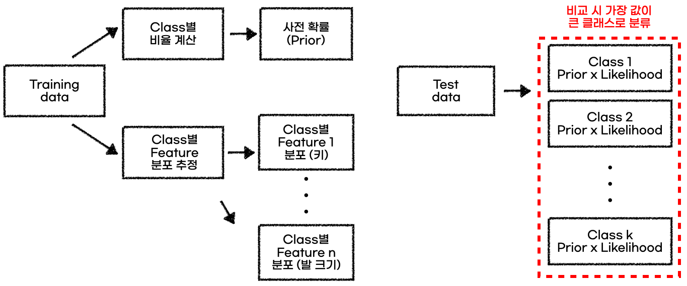

Naive Bayes Classifier를 공부하다 개념적으로 이해가 잘 가지 않아 

요즘 내가 즐겨 보는 유튜버의 강의를 보고 정리해봤다.

확실히 개념 설명을 잘해주신다! 

**출처** 

- ['베이즈 정리' 유튜브](https://www.youtube.com/watch?v=euH9C61ywEM)

- ['나이브 베이즈 분류기' 유튜브](https://www.youtube.com/watch?v=KueAHu7iFNE)

## 1. 베이즈 정리

### [확률로 패러다임의 전환 : 연역적 추론 $\rightarrow$ 귀납적 추론]

1. 빈도주의 : 엄격한 확률 공간을 정의하거나 집단의 분포 정의해 파생된 결과물을 수용하는 형태

   - 동전 앞면이 나올 확률 =$ \frac{1}{2} $ 의 의미는 동전을 100번 던졌을 때, 앞면이 50번 나올 것이라는 의미

   - `연역적 사고`에 기반

   - 확률 계산, 유의성 검정 등

     

2. 베이지안주의 : 확률을 `주장에 대한 신뢰도`로 해석, 경험에 기반한 `불확실성`을 내포하는 수치를 기반

   - 동전 앞면이 나올 확률 =$ \frac{1}{2} $ 의 의미는 동전의 앞면이 나왔다는 주장의 신뢰도가 50%라는 것을 의미
   - `귀납적 사고`에 기반
   - 추가되는 정보를 바탕으로 사전 확률을 갱신
   - 추가 근거 확보를 통해 진리로 더 다가갈 수 있다는 철학 내포

### 베이즈 정리

$P(H|E) = \frac{P(E|H)P(H)}{P(E)}$

H : 가설 혹은 어떤 사건이 발생했다는 주장

E : 새로운 정보(evidence)

**베이지안식 해석**

P(H) : 사전 확률, 어떤 사건이 발생했다는 주장에 관한 신뢰도

P(H|E) : 사후 확률, 새로운 정보를 받은 후 갱신된 신뢰도

즉, 불확실한 사전 확률을 새로운 정보를 통해 더 나은 사후 확률로 업데이트

## 2. 나이브 베이즈 분류기(Naive Bayes Classifier)

베이즈 정리 + 가능도(likelihood)

### [분류에 대한 확률적 판단 근거를 찾아가는 과정]

1. 사전 지식을 이용한 분류(prior)

   확률적인 배경 지식을 가지고 `특별한 추가 정보 없이` 샘플을 분류

   test data sample에 대한 어떠한 정보도 없이 사전 지식만을 가지고 test data sample을 판별할 수 있음

   이런 식으로 판별에 도움을 주는 확률 = 사전 확률

   실제 데이터에서는 training data의 `class간 비율`로 사전 확률을 계산할 수 있음

   

2. 특정 정보가 추가되는 경우(likelihood)

   키(특정 정보)에 따른 성별 판별 문제 : training sample을 통해 키 분포에 관한 정보 미리 도출

   

   

   출처 : https://angeloyeo.github.io/2020/08/04/naive_bayes.html

   

   

3. 결론!! 

   likelihood는 추가 정보이기 때문에 사전 지식에 추가 정보를 추가해 '판단 근거'를 찾는 것이 바람직

   `즉, 판단 근거 = 사전 지식 * 추가 정보`

   

   키가 175인 사람의 성별을

   남자라고 판단할 근거 : P(성별 = 남자) * P(키 = 175 | 성별 = 남자)

   여자라고 판단할 근거 : P(성별 = 여자) * P(키 = 175 | 성별 = 여자)

### 나이브 베이즈 분류기 작동 방식

